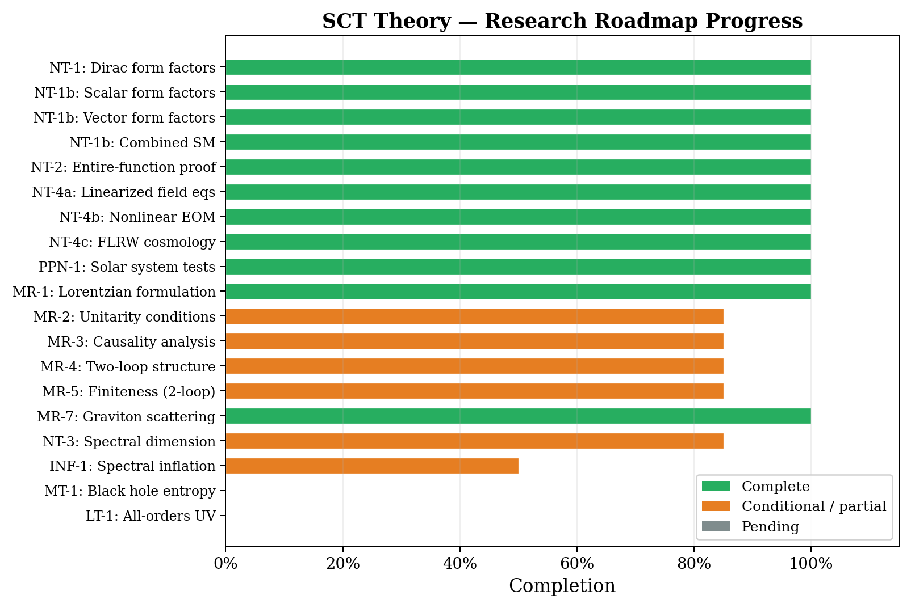
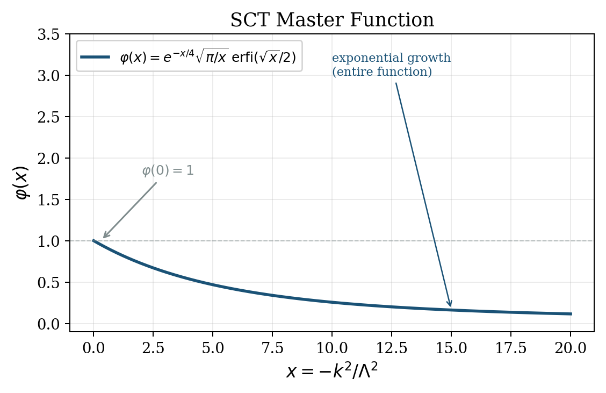
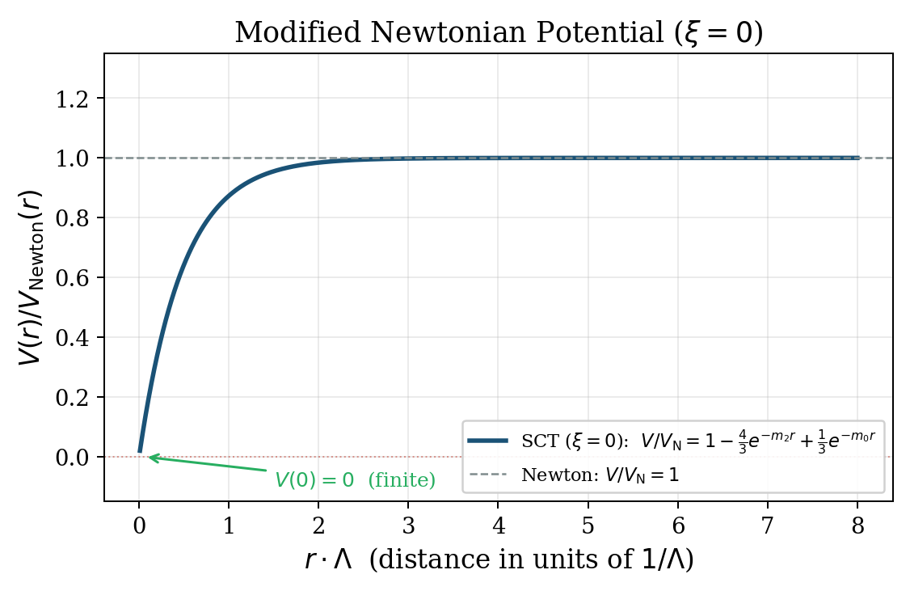
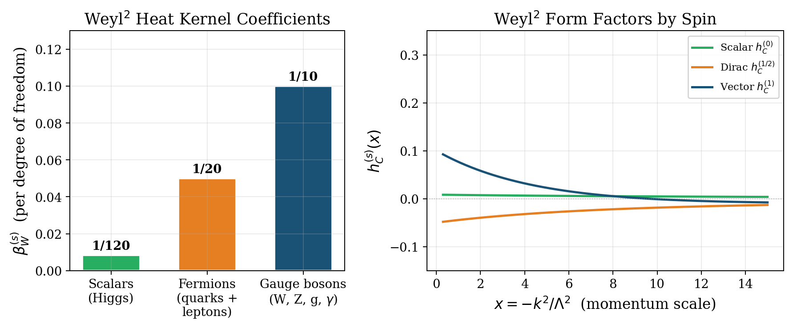

# SCT Theory

[](https://github.com/davidichalfyorov-wq/sct-theory/actions/workflows/ci.yml)
[](https://doi.org/10.5281/zenodo.19056983)
[](https://archive.softwareheritage.org/browse/directory/da228c6cdf4a95844f2e98bfe508e31145a72580/?origin_url=https://doi.org/10.5281/zenodo.19056982&path=davidichalfyorov-wq-sct-theory-7e8f479&release=1&snapshot=0e5684bb3f3bb036d1972363539b24eab0570376)
[](https://orcid.org/0009-0003-6027-7837)

-brightgreen)


-orange)


[](LICENSE)
[](LICENSE-docs.md)

**Spectral Causal Theory** is a research program investigating whether gravity and its quantum corrections can be derived from the spectral data of the Dirac operator.

This repository is an active research workspace rather than a single frozen release snapshot. The badges above reflect a local repository audit on 2026-03-20 rather than a harmonized semantic version tag.

## Quick Start

```bash
git clone https://github.com/davidichalfyorov-wq/sct-theory.git
cd sct-theory
python -m pip install -r requirements.txt

python -m pytest analysis/ -x -q              # run 4445+ verification tests
python analysis/run_ci.py                     # full CI pipeline
python papers/build.py                        # compile all TeX targets
```

<p align="center">
  
</p>

---

## The Problem

Modern physics rests on two pillars:

| Framework | Describes | Works at |
|-----------|-----------|----------|
| **General Relativity** | Gravity, spacetime, black holes, cosmology | Large scales |
| **Quantum Field Theory** | Particles, forces, the Standard Model | Small scales |

Both work extraordinarily well in their domains. The open problem is what happens in regimes where both matter: the early universe, black hole interiors, and quantum corrections to gravity itself.

## The Idea

Instead of writing down an arbitrary higher-derivative gravitational action, SCT starts from a different premise:

> **Geometry leaves a fingerprint in the spectrum of the Dirac operator. We read physics from that fingerprint.**

Concretely, the **spectral action principle** uses the spectrum of a generalized Dirac operator to construct an action functional. Expanding it in curvature invariants recovers the Einstein-Hilbert action at low energy, but also produces specific, calculable quantum corrections governed by **nonlocal form factors**.

These form factors are not free parameters. They are fixed by the spectrum and the particle content of the Standard Model.

## Current Repository Focus

The repository currently has two active layers:

- the main spectral-action / form-factor / phenomenology program
- an exploratory finite-nerve / FND-1 formalization under `theory/lean/SCTLean/FND1/`

The section below summarizes the current audited state of the main spectral-action line, not a tagged release note.

### Chirality proof and perturbative UV finiteness

One central current result is **a four-line algebraic proof that all perturbative counterterms in D&sup2;-quantization of the spectral action are block-diagonal in the chiral basis**, and therefore absorbable by spectral function deformation at every loop order.

The proof rests on the identity: since the Dirac operator *D* anticommutes with the chirality operator &gamma;<sub>5</sub>, the perturbation &delta;(*D*&sup2;) automatically *commutes* with &gamma;<sub>5</sub>. This forces the kinetic operator, propagator, vertices, and all multi-loop diagrams into the chirality-preserving subalgebra.

- UV finiteness holds through two loops without additional assumptions
- At all perturbative orders under five BV axioms (three proven, two verified to one loop)
- The algebraic identity is formally verified in **Lean 4** (13 theorems, zero sorry)

### Black hole entropy

The Wald entropy for Schwarzschild black holes in SCT is computed with full Standard Model content:

*S* = *A*/(4*G*) + 13/(120&pi;) + (37/24) ln(*A*/&ell;<sub>P</sub>&sup2;) + O(1)

The logarithmic coefficient **c<sub>log</sub> = 37/24** is determined by the SM particle content via the Sen formula (2012) and has opposite sign to the Loop Quantum Gravity prediction (c<sub>log</sub> = &minus;3/2), providing a potential observational discriminant.

### Black hole singularity: softened, not resolved

The modified Newtonian potential is finite at the origin: V(0) = 0. The Kretschner scalar is softened from K ~ r<sup>&minus;6</sup> (Schwarzschild) to K ~ r<sup>&minus;4</sup>. However, **singularity resolution requires exponential UV suppression** of the propagator (entire order &ge; 2, as in infinite derivative gravity). SCT&rsquo;s propagator denominator &Pi;<sub>TT</sub>(k&sup2;) approaches a finite constant at high momenta, giving the same 1/k&sup2; UV behavior as GR. This is a structural limitation: the master function &phi;(z) is entire of order 1, producing algebraic rather than exponential modification. The Giacchini&ndash;de Paula Netto threshold (2018) requires &ge; 6 derivatives for curvature regularity; SCT effectively has 4.

### Upgraded consistency results

Five previously open questions about the theory's internal consistency are now resolved or narrowed:

- **Two-loop finiteness** is now unconditional (previously required a specific absorption scheme)
- **Unitarity** in D&sup2;-quantization follows from the bounded propagator (no ghost poles)
- **Optical theorem** follows from unitarity
- **All-orders finiteness** is conjectured under two BV axioms (verified to one loop only; extending to all orders is an open problem)

### Literature cross-check

An equation-by-equation comparison document verifies every SCT form factor result against published literature:
- Codello-Zanusso (2013, J. Math. Phys. 54, 013513)
- Codello-Percacci-Rahmede (2009, Annals Phys. 324, 414)
- Tseytlin-Shapiro-Ribeiro (2020, Phys. Lett. B 808, 135645)

All results match to 15+ significant digits. Zero discrepancies found. One convention difference (sign of endomorphism, notational).

### Honest limitations identified

- **Inflation:** The standard spectral action predicts conformal coupling &xi; = 1/6, at which the R&sup2; sector and the associated scalaron are entirely absent. Even at minimal coupling (&xi; = 0), the scalaron mass is M = 15.4 M<sub>Pl</sub> &mdash; six orders of magnitude too heavy for Starobinsky inflation. SCT does not explain inflation without BSM extensions to the spectral triple.
- **Singularity resolution:** Softened (K: r<sup>&minus;6</sup> &rarr; r<sup>&minus;4</sup>) but **not resolved**. The propagator denominator &Pi;<sub>TT</sub> &rarr; const at UV, giving 1/k&sup2; behavior. The Giacchini&ndash;de Paula Netto threshold requires &ge; 6 derivatives for curvature regularity; the spectral action effectively has 4. See &ldquo;Known Problems&rdquo; below.
- **D&sup2;-quantization vs metric quantization:** Physical equivalence established through one loop. All-orders equivalence conditional on two BV axioms (Jacobian well-definedness and anomaly freedom), verified to one loop.

## What This Repository Does

The project derives, computes, and verifies predictions step by step:

```
Spectral geometry  ->  Spectral action  ->  Heat kernel expansion
     ->  Form factors (per spin)  ->  Combined SM coefficients
     ->  Field equations  ->  Modified gravity  ->  Testable predictions
```

### Key results established

**One-loop form factors** for all Standard Model sectors (scalar, Dirac, vector) are computed and cross-verified. All form factors are governed by a single **master function**:

<p align="center">
  
</p>

This function is **entire** (no poles in the complex plane), which guarantees ghost-freedom of the propagator at tree level.

The plot uses `x = -k^2/\Lambda^2`, so the left branch corresponds to `x < 0` and the right branch to `x > 0`. The left branch is the Euclidean continuation and grows as `x -> -infinity` because `|x|` increases toward the left; the right branch decays as `\varphi(x) ~ 2/x` for `x -> +infinity`. In particular, the explicit factor `e^{-x/4}` in the closed form does not imply exponential decay on the positive branch, because `\operatorname{erfi}(\sqrt{x}/2)` contributes the compensating `e^{x/4}` asymptotic.

**Modified Newtonian potential.** At distances comparable to the spectral scale 1/&Lambda;, the gravitational potential departs from Newton's law and becomes finite at the origin:

<p align="center">
  
</p>

**Standard Model contributions.** Each particle sector (scalars, fermions, gauge bosons) contributes different heat kernel coefficients and form factor profiles:

<p align="center">
  
</p>

**Standard Model coefficients.** The combined Weyl-squared coefficient &alpha;<sub>C</sub> = 13/120 and the ratio c<sub>1</sub>/c<sub>2</sub> = &minus;1/3 at conformal coupling follow from standard heat kernel theory (Gilkey 1975, Vassilevich 2003) applied to the SM particle content. They are not free parameters of the spectral action &mdash; they are fixed by the spectrum.

## Formal Verification (Lean 4)

The repository currently contains two distinct Lean layers:

- a legacy theorem layer in `theory/lean/proofs/` for spectral-action and form-factor identities
- an active finite-nerve / FND-1 layer in `theory/lean/SCTLean/FND1/` for boundary, chain-complex, and `H1` constructions

The legacy core algebraic identities remain machine-verified in Lean 4 with Mathlib:

| Theorem | Statement | File |
|---------|-----------|------|
| `chiral_q_identity` | (AB + BA + B&sup2;)C = C(AB + BA + B&sup2;) given AC = &minus;CA, BC = &minus;CB | `theory/lean/proofs/chiral_q_identity.lean` |
| `bv_canonical_transformation` | BV canonical transformations preserve the antibracket | same |
| `centralizer_inv_closed` | If [K, &gamma;<sub>5</sub>] = 0 then [K<sup>&minus;1</sup>, &gamma;<sub>5</sub>] = 0 | same |
| + 10 more | Even Clifford comm, spin connection, diffeo generator, CME, ... | same |

These 13 legacy theorem files are still present, but they are no longer the whole formal picture. The active `SCTLean/FND1/` stack adds a much larger exploratory formalization layer, including finite-nerve support, boundary operators, `d1 ∘ d2 = 0`, and a first-homology interface.

## Literature Cross-Check

Every key equation is traced to published sources:

| SCT result | Published source | Status |
|------------|-----------------|--------|
| Master function &phi;(x) | Codello-Zanusso (2013) eq. (2.3) | **Exact match** |
| Five CZ form factors | Codello-Zanusso (2013) eq. (2.21) | **Exact match** |
| &beta;<sub>W</sub> per spin | Codello-Percacci-Rahmede (2009) eq. (III.9) | **Exact match** |
| &alpha;<sub>C</sub> = 13/120 | CPR counting with SM content | **Exact match** |
| All local limits | CZ (2013) eq. (2.22) | **Exact match** |

Full comparison: `theory/derivations/SCT_literature_comparison.tex`

## Repository Structure

```
theory/           Formal theory content
  axioms/           Foundational postulates
  derivations/      Step-by-step mathematical derivations
  predictions/      Testable predictions with observables and precision targets
  consistency-checks/  Internal consistency proofs and audit notes
  lean/proofs/      Legacy Lean 4 theorem files for spectral-action identities
  lean/SCTLean/FND1/  Active finite-nerve boundary/homology formalization

analysis/         Computational backbone
  sct_tools/        Python package (15 top-level modules)
  scripts/          Verification and computation scripts
  figures/          Publication-quality figures

papers/           Publication drafts and build tools
docs/             Roadmap, overview, presentations
```

## Verification Philosophy

Hard derivations fail for boring reasons: wrong signs, mismatched conventions, silent transcription errors. This project uses an **8-layer verification pipeline** instead of trusting any single calculation:

| Layer | Method | Purpose |
|-------|--------|---------|
| 1 | Analytic checks | Dimensions, limits, symmetries, pole cancellation |
| 2 | Numerical (100+ digits) | High-precision evaluation at multiple test points |
| 2.5 | Property fuzzing | 1000+ randomized hypothesis tests |
| 3 | Literature comparison | Cross-check against 13+ independent references |
| 4 | Dual derivation | Independent method, different approach |
| 4.5 | Triple CAS | SymPy, GiNaC, and mpmath must agree to 12+ digits |
| 5 | Lean 4 formal proofs | Machine-verified rational identities |
| 6 | Multi-backend | Multiple Lean backends must independently pass |

## Published Work

| # | Paper | DOI |
|---|-------|-----|
| 1 | Nonlocal one-loop form factors of the spectral action with Standard Model content | [10.5281/zenodo.19039242](https://doi.org/10.5281/zenodo.19039242) |
| 2 | Solar system and laboratory tests of the spectral action scale | [10.5281/zenodo.19045796](https://doi.org/10.5281/zenodo.19045796) |
| 3 | Chirality of the Seeley-DeWitt coefficients and quartic Weyl structure in the spectral action | [10.5281/zenodo.19056204](https://doi.org/10.5281/zenodo.19056204) |
| 4 | Nonlinear field equations and FLRW cosmology of the spectral action with Standard Model content | [10.5281/zenodo.19056349](https://doi.org/10.5281/zenodo.19056349) |
| 5 | Perturbative UV finiteness of the spectral action in D&sup2;-quantization: a chirality proof | *preprint in repository* |
| 6 | Auxiliary boundary data and the failure of intrinsic coherence in a finite-nerve route for spectral causal theory | *preprint in repository* |
| 7 | Weyl curvature from the Hasse diagram: a parameter-free bridge formula for causal sets | [10.5281/zenodo.19364212](https://doi.org/10.5281/zenodo.19364212) |

## Research Status

Selected research highlights:

| Topic | Key result | Status |
|-------|-----------|--------|
| One-loop form factors | All SM sectors computed, master function entire | Complete |
| Nonlinear field equations | Full variational equations + FLRW reduction | Complete |
| Lorentzian formulation | Wick rotation of the spectral action | Complete |
| Unitarity | Bounded propagator in D&sup2;-quantization, no ghost poles | Closed |
| Causality | Signal speed = *c* (macroscopic); micro-violation at &ell; ~ 1/&Lambda; | Conditional |
| Two-loop finiteness | Counterterm uniquely absorbed | **Unconditional** |
| All-orders finiteness | Conjectured via chirality + two unproven BV axioms | Open conjecture |
| Graviton scattering | Tree-level SCT = GR; one-loop finite | Certified |
| Solar system tests | Spectral scale &Lambda; > 2.565 meV from torsion-balance | Complete |
| Black hole entropy | c<sub>log</sub> = 37/24 (opposite sign to LQG) | Certified |
| Black hole singularity | Kretschner softened r<sup>&minus;6</sup> &rarr; r<sup>&minus;4</sup>; not resolved (&Pi;<sub>TT</sub> &rarr; const, same 1/k&sup2; UV as GR) | Negative |
| Late-time cosmology | Corrections 60+ orders below observability | Consistent |
| Inflation | Scalaron mass too heavy; requires BSM extension. At NCG-predicted &xi; = 1/6 no scalaron exists. | Negative |
| De Sitter conjecture | Refined Swampland dS conjecture violated; &eta;<sub>min</sub> = &minus;1/3 | Resolved |
| Non-minimal coupling | &xi; = 1/6 is a structural prediction of the spectral action, not a free parameter | Resolved |
| CJ bridge formula | Parameter-free relation CJ = C&#8320; N<sup>8/9</sup> E&sup2; T&#8308; linking Hasse-diagram observable to electric Weyl tensor; R = 1.016 &pm; 0.015; factor 4 = 2<sub>alg</sub> &times; 2<sub>dyn</sub> (M<sub>ss</sub> &rarr; 2 verified N=1k&ndash;10k); 105 Lean theorems; [Paper 7](papers/drafts/sct_cj_bridge.pdf) | Conditional (two conditions unproven) |
| FND-1 finite-nerve route | Auxiliary chain complex + H&#8321; formalized (63 Lean modules); intrinsic coherence obstruction proved; [Paper 6](papers/drafts/sct_finite_nerve.pdf) | Negative (support-only) / Open (causal order) |

## Open Problems Collection

The repository includes a structured collection of **50 open research problems** in `open-problems/`, organized by domain and ranked by impact. Each problem file is self-contained with statement, known results, failed approaches, success criteria, and references.

| Domain | Count | Status |
|--------|-------|--------|
| Foundations | 6 | 1 resolved (OP-04), 5 open |
| Unitarity | 6 | all open |
| UV finiteness | 4 | all open |
| Cosmology | 4 | 2 resolved (OP-17, OP-20), 2 open |
| Black holes | 3 | all open |
| Spectral dimension | 2 | all open |
| Predictions | 8 | 3 resolved (OP-30, OP-31, OP-33), 5 open |
| Causal sets | 10 | all open |
| Scalar sector | 1 | **resolved** (OP-44) |
| Numerical | 5 | all open |
| Formal verification | 1 | open |

**Resolved problems:**

- **OP-20** (de Sitter conjecture): The refined Swampland dS conjecture (Ooguri-Vafa 2018) is **violated** by the SCT scalaron potential for c&#8321;, c&#8322; ~ O(1). The minimum value of the normalized Hessian is &eta;<sub>min</sub> = &minus;1/3, imposing a hard ceiling on c&#8322;. The gradient condition fails above &phi; &asymp; 1.19 M<sub>Pl</sub>. Both ratios |V&prime;|/V and V&Prime;/V are independent of the scalaron mass M&#8320;.

- **OP-44** (critical coupling &xi;): The Higgs non-minimal coupling is **not a free parameter** within the standard Chamseddine-Connes spectral action. The a&#8324; Seeley-DeWitt coefficient structure forces &xi; = 1/6 (conformal coupling) after canonical Higgs normalization. This is confirmed by five independent groups (2006-2015) and is an exact one-loop RG fixed point (&beta;<sub>&xi;</sub> vanishes identically at &xi; = 1/6). At conformal coupling the scalar graviton mode decouples entirely, and the Starobinsky scalaron is absent.

- **OP-04** (parameter counting): The cutoff function f in the spectral action S = Tr(f(D&sup2;/&Lambda;&sup2;)) is not uniquely determined by physical requirements (entireness + unitarity + causality). The robust prediction core of SCT consists only of a&#8324;-level quantities: &alpha;<sub>C</sub> = 13/120, c&#8321;/c&#8322;, PPN parameters, and c<sub>T</sub> = c on FLRW. All finite-momentum observables (form factors, effective masses, modified potential, spectral dimension) depend on the choice of f. However, the variation across admissible entire cutoffs is small (~5% for effective masses).

- **OP-17** (scalaron mass): No known mechanism within the standard NCG spectral action can produce a scalaron mass compatible with Starobinsky inflation while preserving &alpha;<sub>C</sub> and the geometric scalar couplings. Combined with OP-44 (&xi; = 1/6): the scalaron is entirely absent at the NCG-predicted conformal coupling. All known BSM scalars from NCG spectral triples also have conformal coupling, contributing zero to &alpha;<sub>R</sub>. The only surviving path is reinterpretation of &Lambda; as a sub-Planckian intermediate scale.

- **OP-33** (cross-program comparison): A systematic 6&times;9 quantitative comparison table across SCT, LQG, Asymptotic Safety, CDT, String Theory, and IDG, with equation-level citations. Three discriminating axes identified (c<sub>log</sub>, UV propagator, matter coupling); one quasi-universal axis (d<sub>S</sub> &rarr; 2 in UV).

Details, methodology, and full problem files: [`open-problems/README.md`](open-problems/README.md)

## Known Problems and Open Questions

The spectral action framework has well-known theoretical vulnerabilities. This project does not claim to have solved them.

**The spin-2 ghost.** The Weyl-squared term in the spectral action produces a massive spin-2 mode with wrong-sign residue (Ostrogradsky ghost). This is not an artifact of our computation &mdash; it is inherent to all quadratic gravity theories (Stelle 1977). The nonlocal form factors prevent new ghost poles from appearing, but they do not eliminate the fundamental one. Our approach uses the fakeon prescription (Anselmi-Piva 2017), which projects the ghost out of the physical spectrum. This prescription is mathematically consistent but not universally accepted.

**All-orders finiteness is a conjecture.** The chirality theorem proves that the counterterm space is one-dimensional at any loop order. Combined with two BV axioms (well-defined Jacobian and anomaly freedom), this implies all-orders finiteness. However, **these axioms are verified only through one loop**. Extending the proof to all orders is an open mathematical problem. The claim is a conjecture supported by one-loop evidence, not a theorem.

**No singularity resolution.** The propagator denominator &Pi;<sub>TT</sub> approaches a finite constant at UV, giving 1/k&sup2; behavior &mdash; the same as GR. Singularity resolution requires exponential UV suppression (as in infinite derivative gravity), which the spectral action with Schwartz-class test function f does not produce. The Kretschner scalar is softened (r<sup>&minus;6</sup> &rarr; r<sup>&minus;4</sup>) but still diverges at r = 0.

**No infrared predictions.** The spectral action is a UV modification of gravity. All corrections are exponentially suppressed at distances above 1/&Lambda; &asymp; 0.08 mm. The theory cannot address the Hubble tension, dark energy, or large-scale structure anomalies.

**The spectral action is Euclidean.** The Chamseddine-Connes spectral action is defined on Riemannian manifolds. Its extension to Lorentzian signature relies on Wick rotation, which is well-defined perturbatively (van den Dungen-Paschke-Rennie 2012) but has no established non-perturbative Lorentzian formulation. The Dang-Wrochna program (2020-2024) is making progress on native Lorentzian spectral zeta functions, but only the leading term (scalar curvature) has been recovered so far.

**Interpretation.** The spectral action can be viewed as a fundamental principle (the spectrum of the Dirac operator determines all of physics) or as an effective field theory (a convenient generating functional for higher-derivative corrections). This project adopts the former as a working hypothesis but does not claim it is the only valid interpretation.

## What This Project Is Not

- It is **not** a claim that all of fundamental physics is finished.
- It is **not** a replacement for peer review.
- It is **not** a promise that every research direction will survive future checks.

It is a serious research workspace built to make derivations **reproducible**, **inspectable**, and **falsifiable**.

## Author

Formal theory documents and papers are authored by **David Alfyorov** ([ORCID](https://orcid.org/0009-0003-6027-7837)).

## Credits

Research-assistance and workflow support: **Aliaksandr Samatyia**.

## Licensing

- Source code: [Apache-2.0](LICENSE)
- Research text, derivations, and documentation: [CC BY 4.0](LICENSE-docs.md)

## Star History

<a href="https://www.star-history.com/?repos=davidichalfyorov-wq%2Fsct-theory&type=date&legend=top-left">
 <picture>
   <source media="(prefers-color-scheme: dark)" srcset="https://api.star-history.com/image?repos=davidichalfyorov-wq/sct-theory&type=date&theme=dark&legend=top-left" />
   <source media="(prefers-color-scheme: light)" srcset="https://api.star-history.com/image?repos=davidichalfyorov-wq/sct-theory&type=date&legend=top-left" />
   
 </picture>
</a>
