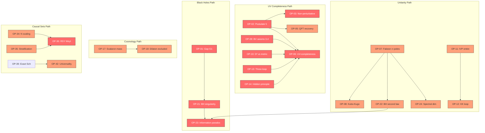

# SCT Open Problems: Dependency Graph

## Critical paths

1. **UV path:** OP-02 → OP-06, with OP-09/10/13/14 as parallel inputs
2. **BH path:** OP-01 → OP-21 → OP-23, with OP-07 → OP-22 as parallel input
3. **CJ bridge path:** OP-34 + OP-35 → OP-36
4. **Cosmology path:** OP-17 → OP-18 (short, somewhat isolated)

## Unblocked problems (can start immediately)

OP-04, OP-07, OP-13, OP-14, OP-17, OP-20, OP-33, OP-34, OP-37, OP-40,
OP-44, OP-45, OP-46, OP-47, OP-48, OP-49, OP-50
